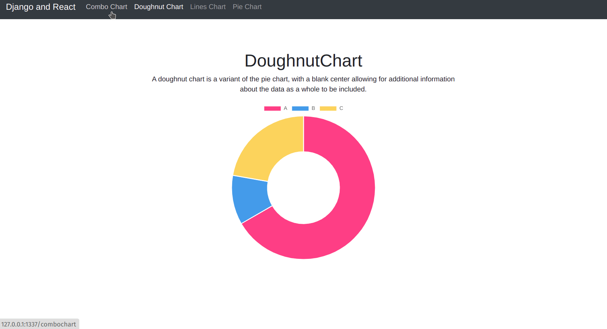

# django_react
Integrating ReactJs seamlessly using django-compressor-parceljs without webpack in your django project

## Quick Start
For development: 

```docker-compose up --build```


For production:

 ```docker-compose -f docker-compose-prod.yml up --build```


## Preview

